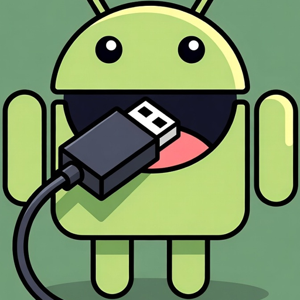
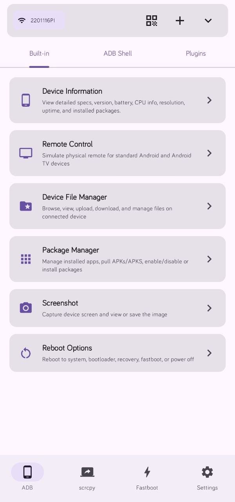
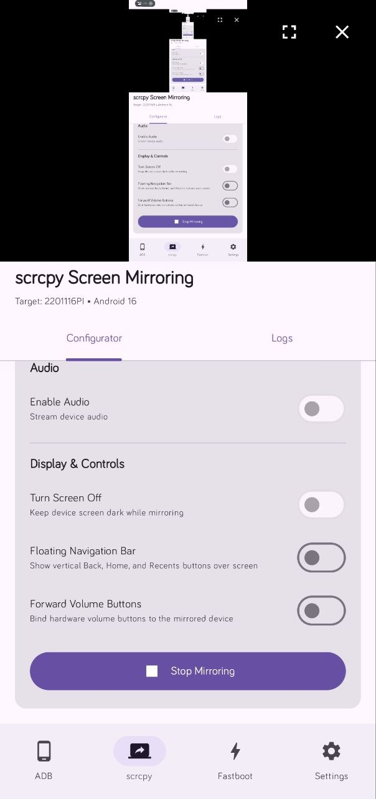
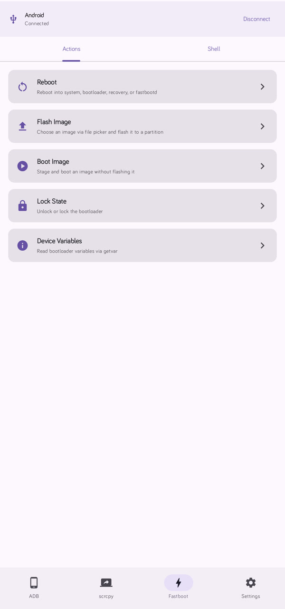
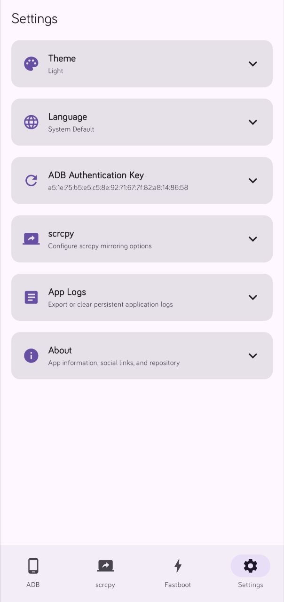

# Dioxamine

  

Dioxamine lets you send ADB commands, mirror and control Android devices, manage files and apps, and use Fastboot—all from your phone via USB OTG or Wireless ADB.

> [!WARNING]
> Dioxamine is currently in an early alpha stage and under active development. Expect bugs, incomplete features, and sudden updates. Use at your own risk.

## Screenshots

  
  
  
  

## What Dioxamine Can Do

### How to Connect
- **USB OTG**: Connect two devices using a USB OTG cable adapter.
- **Wireless ADB**: Connect wirelessly over Wi-Fi or hotspot. Both devices must be connected to the same network (such as a shared Wi-Fi network or one device connected to the other's portable hotspot). Supports auto discovery, QR code pairing, and port pairing code input.

> [!NOTE]
> Device Specific Note (HyperOS / MIUI):
> On certain Android skins like HyperOS or MIUI, you may need to enable additional Developer Options such as **USB debugging (Security settings)** in addition to Wireless Debugging to allow remote touch control and screen mirroring to work properly.

### ADB Device Control
- Control secondary Android phones, tablets, and Android TV devices directly.
- Check device specs, CPU usage, battery stats, and uptime.
- File manager to browse, upload, and download files on target storage.
- Package manager to install, uninstall, enable, disable, or pull APK files.
- Capture screenshots and reboot into system, bootloader, recovery, fastbootd, or power off.
- Run terminal commands using the interactive ADB shell.
- Sideload firmware packages and access Rescue mode.

### Scrcpy Screen Mirroring and Remote Control
- Real-time screen mirroring and full interactive touch control over Wi-Fi or USB OTG.
- Stream target device audio alongside video output.
- Keep the target device screen dark while controlling and mirroring to save battery.
- Floating navigation bar and physical volume button forwarding.
- Adjust display resolution, FPS, and bitrate settings.

### Fastboot Tools
- Flash image files 
- Lock and unlock bootloader state.
- Interactive Fastboot terminal.

## Feedback and Suggestions

Suggestions for new features and improvements are welcome. If you have ideas or notice bugs, feel free to share your feedback.

[Telegram Channel](https://t.me/tr1ple_fault)

## License

This project is licensed under the Apache License 2.0. See the [LICENSE](LICENSE) file for details.
